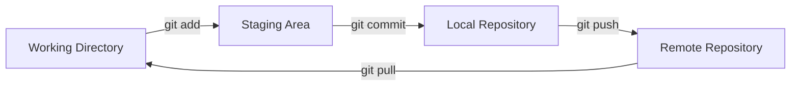
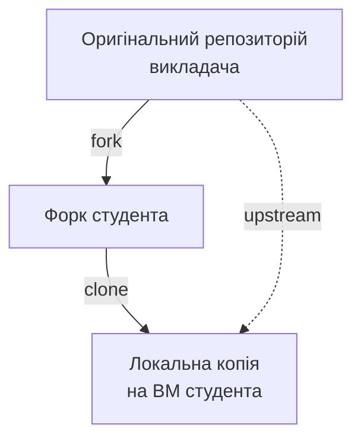

# Тема 5: Код має бути під контролем — Теорія

> **Конспект лекції для студентів.** Читайте до і після заняття.
> Парний файл: `05_Version_Control_Lab.md` (лабораторна робота)

---

## 🎯 Бізнес-задача

Ми пройшли шлях від створення віртуальної машини до налаштування безпечного SSH-доступу. Тепер на сервері порожньо — немає жодного файлу проєкту. 

Уявіть: ви DevOps-інженер, який отримав завдання розгорнути новий сервіс. У вас є:
- Працюючий сервер з Linux
- SSH-доступ без пароля
- URL репозиторію з кодом

Що робити далі? Як доставити код на сервер так, щоб:
- Можна було повернутися до будь-якої попередньої версії?
- Зміни не загубилися при помилці?
- Можна було працювати паралельно з колегами?

**Відповідь:** використати систему контролю версій.

**Зв'язок з проєктом:** У курсі ми використовуємо навчальний проєкт `training-project`, який знаходиться в репозиторії курсу. Студенти створюють власний форк цього репозиторію і працюють зі своєю копією.

---

## 🧠 Необхідні знання

### 1. Навіщо потрібна система контролю версій?

**Проблема без VCS (Version Control System):**

Уявімо, що ми просто копіюємо файли на сервер через SCP:

```bash
scp -r ./my-project user@server:/home/user/
```

Що станеться, якщо:
- Ми зробили помилку в конфігурації і хочемо повернутися? → Потрібно зберігати резервні копії вручну: `config.yml.bak`, `config.yml.bak.2`, `config.yml.old`...
- Двоє розробників редагують один файл? → Останній, хто скопіював файл, перезапише зміни іншого.
- Потрібно зрозуміти, хто і коли змінив критичний параметр? → Немає історії змін.

**Рішення:** Система контролю версій (VCS).

**VCS** — це «машина часу» для файлів. Вона зберігає:
- Повну історію всіх змін
- Хто, коли і що змінив
- Можливість повернутися до будь-якого стану

**Ключові поняття:**

- **VCS (Version Control System)** — система контролю версій; програмне забезпечення для відстеження змін у файлах
- **Repository (Репозиторій)** — сховище файлів проєкту разом з повною історією змін

---

### 2. Git: базові концепції

**Git** — найпопулярніша розподілена система контролю версій. Її створив Лінус Торвальдс у 2005 році для розробки ядра Linux.

#### Основні поняття Git:

| Поняття | Пояснення | Аналогія |
| ------- | --------- | -------- |
| **Repository** | Сховище файлів з історією | «Проєктна папка з машинкою часу» |
| **Commit** | Збережений стан файлів у певний момент | «Контрольна точка» або «знімок» |
| **Branch** | Паралельна лінія розробки | «Альтернативна реальність» для експериментів |
| **Clone** | Копія віддаленого репозиторію | «Завантажити проєкт собі» |
| **Fork** | Власна копія чужого репозиторію | «Зробити свою версію чужого проєкту» |
| **Push** | Відправити зміни на віддалений репозиторій | «Вивантажити свої зміни» |
| **Pull** | Отримати зміни з віддаленого репозиторію | «Завантажити чужі зміни» |

#### Робочий процес Git:



1. **Working Directory** — ваші файли на диску
2. **Staging Area** — файли, підготовлені до коміту
3. **Local Repository** — локальна історія змін
4. **Remote Repository** — репозиторій на сервері (GitHub, GitLab)

**Ключові поняття:**

- **Commit** — фіксація змін у репозиторії; кожен коміт має унікальний ідентифікатор (hash)
- **Branch** — незалежна лінія розробки; дозволяє працювати над функціями паралельно

---

### 3. Fork та модель `origin` / `upstream`

У навчальному контексті ми використовуємо модель **Fork + Clone**, яка є стандартом для open-source проєктів.

#### Що таке Fork?

**Fork** — це персональна копія чужого репозиторію на GitHub/GitLab. Ви можете вільно змінювати свій форк без впливу на оригінал.



#### `origin` vs `upstream`

| Remote | Що це | Права доступу |
| ------ | ----- | ------------- |
| **origin** | Ваш форк (куди ви можете push) | Read + Write |
| **upstream** | Оригінальний репозиторій (звідки ви берете оновлення) | Read-only |

**Чому це важливо:**

- Студенти не можуть випадково «зламати» основний репозиторій курсу
- Кожен студент має власний простір для експериментів
- Викладач може оновлювати курс, а студенти — підтягувати зміни через `upstream`

**Ключові поняття:**

- **Fork** — персональна копія репозиторію на GitHub/GitLab
- **origin** — віддалений репозиторій, куди ви маєте право писати (ваш форк)
- **upstream** — оригінальний репозиторій, звідки ви берете оновлення

---

### 4. Файл `.gitignore`

Не всі файли повинні потрапляти в репозиторій.

**Що НЕ комітять:**

- Секрети: `.env` з паролями, API-ключі
- Згенеровані файли: `node_modules/`, `__pycache__/`, `*.pyc`
- Системні файли: `.DS_Store`, `Thumbs.db`
- IDE-файли: `.idea/`, `.vscode/` (іноді)

**Файл `.gitignore`** — список шаблонів файлів, які Git ігнорує.

Приклад:

```gitignore
# Секрети
.env
*.key
secrets/

# Залежності
node_modules/
__pycache__/
*.pyc

# IDE
.idea/
.vscode/

# Системні
.DS_Store
```

**Ключові поняття:**

- **`.gitignore`** — файл зі списком шаблонів файлів, які Git не відстежує

---

### 5. Git як «Single Source of Truth»

У DevOps-культурі репозиторій — це не просто «місце для коду». Це **єдина точка істини** для всього проєкту.

**Що живе в Git:**

| Тип файлів | Приклад |
| ---------- | ------- |
| Код програми | `src/`, `app.py`, `index.js` |
| Конфігурація | `config.json`, `settings.yml` |
| Інфраструктура | `ansible/`, `terraform/`, `docker-compose.yml` |
| Документація | `README.md`, `docs/` |
| Тести | `tests/`, `spec/` |

**Що НЕ живе в Git:**

- Секрети (паролі, ключі, токени)
- Великі бінарні файли
- Згенеровані артефакти

**Принцип:** Якщо щого немає в Git — цього не існує. Якщо щось є в Git — це офіційна версія.

**Ключові поняття:**

- **Single Source of Truth** — єдине авторитетне джерело інформації про стан проєкту
- **Docs as Code** — підхід, при якому документація зберігається в Git і версіонується разом з кодом
- **Infrastructure as Code (IaC)** — підхід, при якому конфігурація інфраструктури описується в файлах і зберігається в Git

---

### 6. Підготовка до роботи: під яким користувачем і куди клонувати?

Перед тим як клонувати репозиторій, потрібно визначити два важливі моменти:

1. **Під яким користувачем працювати?**
2. **Куди покласти репозиторій?**

#### Під яким користувачем працювати?

У Темі 2 ми створили виділеного користувача `openclaw` (або аналогічного) без прав `sudo`. Це було зроблено не просто так — **принцип найменших привілеїв** вимагає, щоб ми не працювали під `root`.

**Золоте правило:** Робота з Git і кодом повинна виконуватися під **звичайним користувачем**, а не під `root`.

Чому?

- Якщо ви випадково виконаєте шкідливий скрипт, він матиме обмежені права
- Файли, створені `root`, будуть недоступні для звичайних користувачів
- Це стандартна практика в індустрії

#### Куди клонувати репозиторій?

**Стандартна практика Linux:**

| Місце | Призначення | Приклад |
| ----- | ----------- | ------- |
| `/home/username/` | Особисті проєкти користувача | `/home/openclaw/projects/` |
| `/opt/` | Системні проєкти, доступні кільком користувачам | `/opt/openclaw/` |
| `/var/www/` | Веб-проєкти | `/var/www/myapp/` |
| `/usr/local/` | Встановлене вручну ПЗ | `/usr/local/myapp/` |

**Для навчального проєкту** ми рекомендуємо:

```text
/home/openclaw/
└── projects/
    └── devops-course/    ← Репозиторій курсу
```

**Чому саме сюди?**

- Це домашня директорія користувача — він має повні права
- Не потребує `sudo` для створення файлів
- Стандартна практика для особистих проєктів
- Легко знайти: `cd ~/projects/devops-course`

---

### 7. Практичний робочий процес для Теми 5

У теорії нам важливо не просто показати послідовність команд, а пояснити, **що саме вони означають** і **чому ми виконуємо їх саме так**. Тому нижче кожен крок супроводжується коротким тлумаченням.

#### Крок 0: Підготовка (підключення під правильним користувачем)

На цьому етапі ми не «просто заходимо на сервер», а перевіряємо дві базові речі:

- ми працюємо не під `root`, а під обмеженим користувачем `openclaw`;
- у цього користувача є окреме місце для проєктів у домашній директорії.

```bash
# Підключаємося до ВМ (якщо ще не підключені)
ssh openclaw@192.168.56.10

# Перевіряємо, під яким користувачем ми
whoami
# Вивід має бути: openclaw (НЕ root!)

# Створюємо директорію для проєктів
mkdir -p ~/projects
cd ~/projects
```

**Що означають ці команди:**

- `ssh openclaw@192.168.56.10` — підключення до ВМ під користувачем `openclaw`; частина до символу `@` — це ім'я користувача, після `@` — IP-адреса сервера.
- [`whoami`](DevOps/05_Version_Control/05_Version_Control_Theory.md:261) — показує, під яким користувачем ми зараз працюємо.
- `mkdir -p ~/projects` — створює директорію `projects` у домашній теці користувача; прапорець `-p` означає «створити каталог і не видавати помилку, якщо він уже існує».
- `cd ~/projects` — переходить у каталог, де ми будемо зберігати репозиторії.

#### Крок 1: Форк репозиторію

На GitHub/GitLab (у браузері на хост-машині):
1. Відкрити сторінку курсового репозиторію
2. Натиснути кнопку «Fork»
3. Вибрати свій акаунт як місце для форку

**Що тут відбувається концептуально:**

- **Fork** — це не клон на ваш комп'ютер, а окрема копія репозиторію у вашому акаунті на GitHub/GitLab.
- Після форку студент отримує власний віддалений репозиторій, куди він має право виконувати [`push`](DevOps/05_Version_Control/05_Version_Control_Theory.md:67).
- Оригінальний репозиторій викладача залишається недоторканим.

#### Крок 2: Клонування форку

На ВМ (під користувачем `openclaw`):

```bash
# Клонування вашого форку в директорію projects
cd ~/projects
git clone https://github.com/YOUR_USERNAME/devops-course.git

# Перехід у директорію проєкту
cd devops-course

# Перевіряємо, де ми знаходимося
pwd
# Вивід: /home/openclaw/projects/devops-course
```

**Що означають ці команди:**

- `git clone ...` — створює локальну копію віддаленого репозиторію на диску ВМ.
- `YOUR_USERNAME` у URL — це акаунт студента, тобто ми клонуємо **свій форк**, а не репозиторій викладача.
- `cd devops-course` — переходимо в корінь репозиторію.
- [`pwd`](DevOps/05_Version_Control/05_Version_Control_Theory.md:289) — показує повний шлях до поточної директорії; це проста перевірка, що ми дійсно працюємо в правильному місці.

#### Крок 3: Додавання upstream

```bash
# Додавання оригінального репозиторію як upstream
git remote add upstream https://github.com/INSTRUCTOR/devops-course.git

# Перевірка налаштувань
git remote -v
```

Вивід має показати:
```
origin    https://github.com/YOUR_USERNAME/devops-course.git (fetch)
origin    https://github.com/YOUR_USERNAME/devops-course.git (push)
upstream  https://github.com/INSTRUCTOR/devops-course.git (fetch)
upstream  https://github.com/INSTRUCTOR/devops-course.git (push)
```

**Що означає понятійний апарат у цьому кроці:**

- **Remote** — це іменоване посилання на віддалений репозиторій.
- `origin` — стандартне ім'я для того репозиторію, з якого ми виконали [`clone`](DevOps/05_Version_Control/05_Version_Control_Theory.md:65). У нашому випадку це **форк студента**.
- `upstream` — додатковий remote, який вказує на **оригінальний репозиторій викладача**.

**Що означає команда:**

- `git remote add upstream ...` — додає новий віддалений репозиторій з ім'ям `upstream`.
- `git remote -v` — показує список усіх remote-репозиторіїв та їхні URL-адреси.

**Навіщо це потрібно:**

- у `origin` ми відправляємо власні зміни;
- з `upstream` ми можемо пізніше отримувати оновлення від викладача.

#### Крок 4: Створення особистої гілки

```bash
# Створення нової гілки
git checkout -b my-topic5-work

# Перевірка поточної гілки
git branch
```

**Що означають ці команди:**

- `git checkout -b my-topic5-work` — одночасно створює нову гілку і відразу перемикає нас на неї.
- **Branch** — це окрема лінія змін. Вона дозволяє експериментувати, не змінюючи основну гілку `main`.
- `git branch` — показує список локальних гілок і позначає поточну зірочкою `*`.

#### Крок 5: Внесення зміни

```bash
# Редагування файлу (наприклад, додавання себе в README)
echo "Студент: Ваше Ім'я" >> README.md

# Перевірка статусу
git status
```

**Що означають ці дії:**

- ми навмисно робимо маленьку безпечну зміну, щоб побачити повний цикл роботи з Git;
- `git status` — одна з найважливіших команд у Git, вона показує:
  - у якій ви гілці;
  - які файли змінені;
  - які файли ще не підготовлені до коміту.

#### Крок 6: Коміт та push

```bash
# Додавання файлу до staging area
git add README.md

# Створення коміту
git commit -m "Додано інформацію про студента"

# Відправка на ваш форк
git push origin my-topic5-work
```

**Що означають ці команди:**

- `git add README.md` — додає файл у **staging area**, тобто в список змін, які увійдуть у наступний коміт.
- `git commit -m "..."` — створює коміт, тобто зафіксований знімок змін з коротким повідомленням.
- `git push origin my-topic5-work` — відправляє локальну гілку `my-topic5-work` у віддалений репозиторій `origin`.

**Чому ми пушимо саме в `origin`, а не в `upstream`:**

- `origin` — це власний форк студента, куди він має право запису;
- `upstream` — це репозиторій викладача, який у цьому сценарії є джерелом оновлень, а не місцем для прямих студентських змін.

---

## ❓ Питання для обговорення на занятті

1. Чому ми робимо форк, а не просто клонуємо репозиторій викладача? Які проблеми виникнуть без форку?

2. Що станеться, якщо студент випадково виконає `git push origin main` у своєму форку? Чи це вплине на репозиторій викладача?

3. Навіщо потрібен файл `.gitignore`? Що станеться, якщо випадково закомітити `.env` з реальним API-ключем у публічний репозиторій?

4. Як ви думаєте, чому в DevOps кажуть «якщо чогось немає в Git — цього не існує»?

---

## 🔗 Що далі

Тепер, коли ми маємо проєкт під контролем версій, виникає нова проблема: ми витратили 5 тем на ручне налаштування однієї ВМ. Якщо вона зламається — доведеться починати з нуля. А якщо потрібно налаштувати 10 серверів? Нам потрібен спосіб описати конфігурацію у файлі та відтворити її автоматично. Це і є тема **Теми 6: Infrastructure as Code**.
